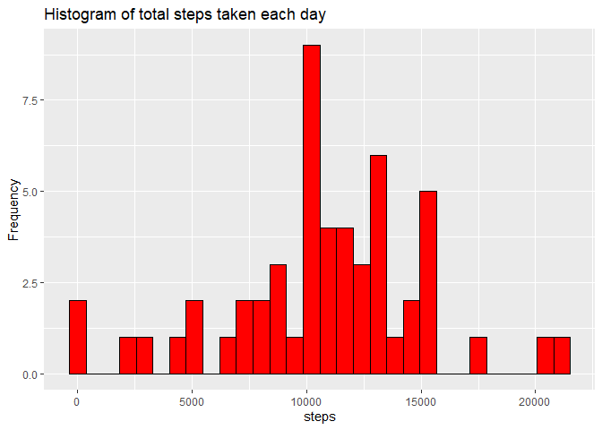
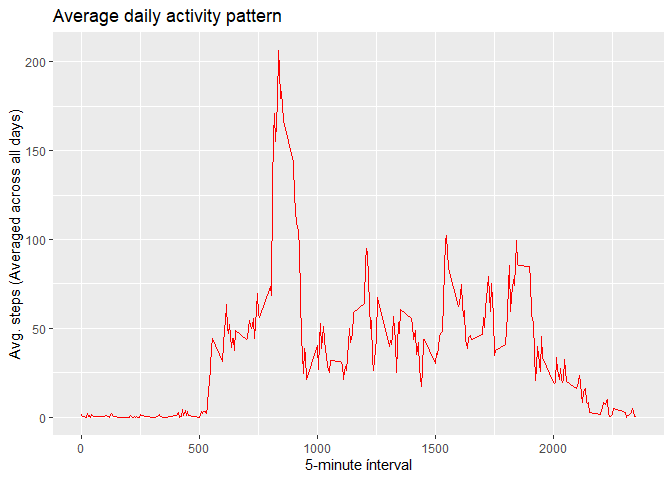
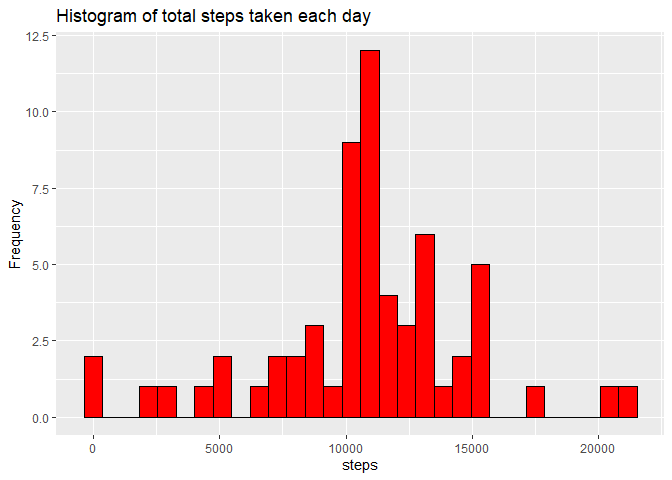
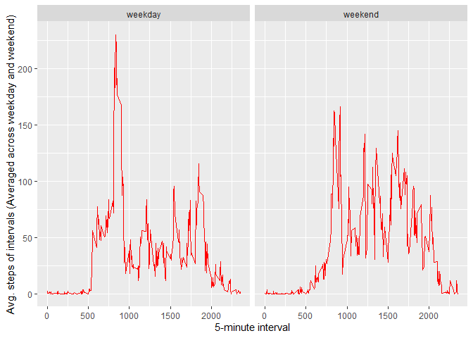

## Loading and preprocessing the data with dplyr package
I set my working directory and load the data.

```r
setwd("C:/Users/Zhiming/Desktop/Creative/Coursera/Reproducible Research")
data <- read.csv("activity.csv")
```

Next, I use the dplyr package to process the data by removing the interval variable and collapsing on the date so I can calculate the total number of steps for each day.

```r
library(dplyr)
tbl1 <- tbl_df(data)
tbl1 <- select(data, date, steps)
tbl1 <- group_by(tbl1, date)
```

## What is mean total number of steps taken per day?
I use the processed data assigned to "tbl1" and use summarize_each() to calculate the total number of steps for each day.

```r
tbl1 <- summarize_each(tbl1, funs(sum))
```

Then I make a histogram using the ggplot2 package.

```r
library(ggplot2)
tbl1$steps <- as.numeric(tbl1$steps)
ggplot(tbl1, aes(x=steps)) + 
        geom_histogram(color = "black", fill = "red") + 
        labs(y = "Frequency", title = "Histogram of total steps taken each day")  
```

<!-- -->

I calculate the mean and median of the total number of steps taken each day.

```r
mean(tbl1$steps, na.rm = TRUE)
```

```
## [1] 10766.19
```

```r
median(tbl1$steps, na.rm = TRUE)
```

```
## [1] 10765
```

## What is the average daily activity pattern?
I make a time series plot of the 5-minute interval (x-axis) and the average number of steps taken, averaged across all days (y-axis). To do this, I make a new processed data frame from the original data by collapsing on the interval so I can calculate the average steps on that specific 5-minute interval mark, averaged across all days.

```r
tbl2 <- tbl_df(data)
tbl2 <- select(data, interval, steps)
tbl2 <- group_by(tbl2, interval)
tbl2 <- na.omit(tbl2)
tbl2 <- summarize_each(tbl2, funs(mean))
```

I plot using ggplot.

```r
ggplot(tbl2, aes(x=interval, y=steps)) +
        geom_line(col = "red") +
        labs(title = "Average daily activity pattern", x = "5-minute ínterval", y = "Avg. steps (Averaged across all days)")
```

<!-- -->

To answer which 5-minute interval contains the maximum number of steps, on average across all days, I use the which.max() function on the rows of the data frame assigned "tbl2".

```r
tbl2[which.max(tbl2$steps),]
```

```
## # A tibble: 1 x 2
##   interval steps
##      <int> <dbl>
## 1      835  206.
```
We see that the 5-minute interval at 835 has the maximum number of steps of 206.

## Imputing missing values
I calculate the total number of NA values in the data set.

```r
sum(as.logical(is.na(data)))
```

```
## [1] 2304
```

Next, my strategy for filling in the NA values is to take replace them with the mean for each 5-minute interval that I calculated and assigned to "tbl2". I do this by joining the original data frame with "tbl2" containing the mean values for each 5-minute interval averaged across days. 

```r
newdata <- data
newdata$steps[match(tbl2$interval, newdata$interval)] <- tbl2$steps
NAfill <- left_join(newdata, tbl2, by ="interval")
NAfill <- mutate(NAfill, steps=coalesce(steps.x,steps.y))
NAfill <- select(NAfill, steps, date, interval)
```

Then I process the data frame "NAfill" and calculate the total number of steps for each day and make a histogram 

```r
tbl3 <- tbl_df(NAfill)
tbl3 <- select(tbl3, date, steps)
tbl3 <- group_by(tbl3, date)
tbl3 <- summarize_each(tbl3, funs(sum))
ggplot(tbl3, aes(x=steps)) + 
        geom_histogram(color = "black", fill = "red") + 
        labs(y = "Frequency", title = "Histogram of total steps taken each day")
```

<!-- -->

I calculate the mean and median of the total number of steps taken each day.

```r
mean(tbl3$steps)
```

```
## [1] 10766.19
```

```r
median(tbl3$steps)
```

```
## [1] 10766.19
```

We see that the values do not differ from the first part of the assignment when we ignored the missing values. We see a higher frequency of the mean value because all the missing values are replaced with this exact value. In conclusion, imputing missing data does not increase the total daily number of steps in each day because all the NA values are found within the same days resulting in more days where steps are accounted for.

## Are there differences in activity patterns between weekdays and weekends?
I replace the old date variable with a new factor varaible with 2 levels.

```r
NAfill$date <- weekdays(as.Date(NAfill$date))
NAfill$date[NAfill$date == "Monday"] <- as.character("weekday")
NAfill$date[NAfill$date == "Tuesday"] <- as.character("weekday")
NAfill$date[NAfill$date == "Wednesday"] <- as.character("weekday")
NAfill$date[NAfill$date == "Thursday"] <- as.character("weekday")
NAfill$date[NAfill$date == "Friday"] <- as.character("weekday")
NAfill$date[NAfill$date == "Saturday"] <- as.character("weekend")
NAfill$date[NAfill$date == "Sunday"] <- as.character("weekend")
NAfill$date <- factor(NAfill$date)
```

I make a panel plot of the 5-minute interval and the average number of steps taken, averaged across all weekdays or weekend days (3 variables in total).

```r
tbl4 <- group_by(NAfill, interval, date)
tbl4 <- summarize_each(tbl4, funs(mean))
ggplot(tbl4, aes(x=interval, y=steps)) +
        geom_line(col="red") +
        facet_grid(.~ date) +
        labs(y = "Avg. steps of intervals (Averaged across weekday and weekend)", x = "5-minute interval")
```

<!-- -->
